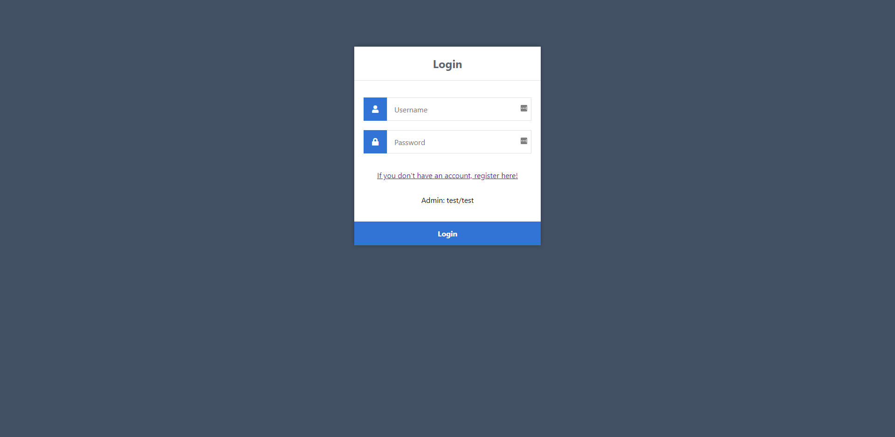
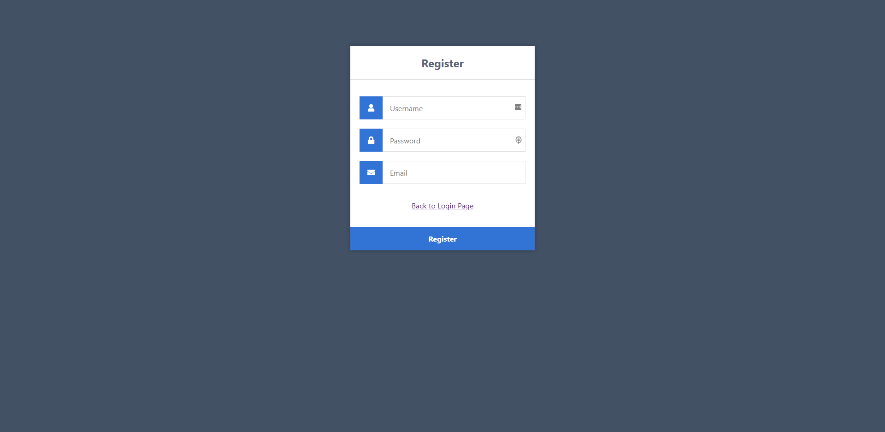
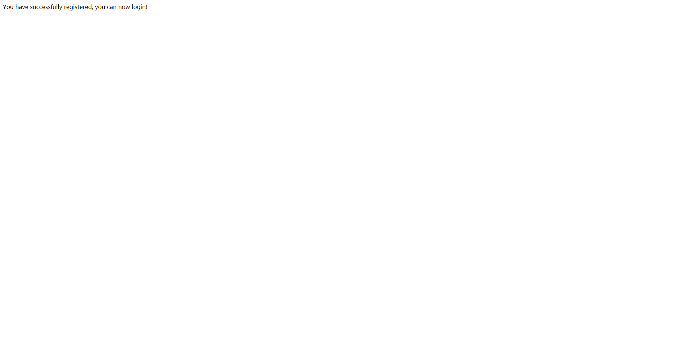
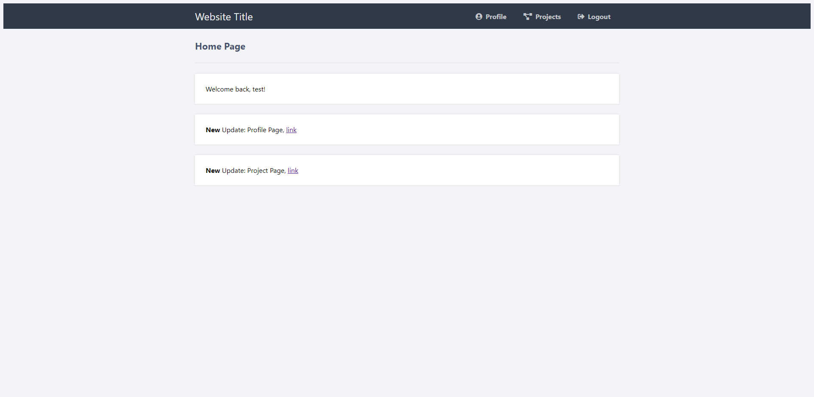
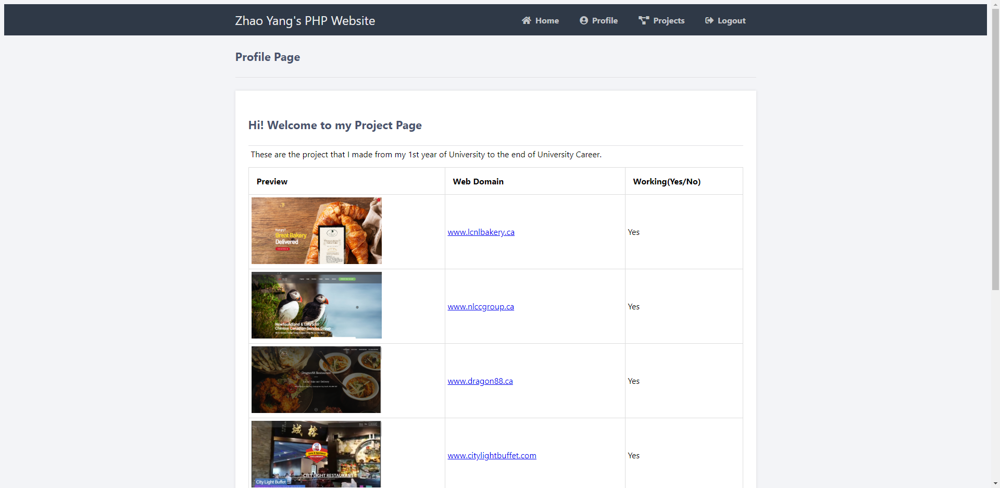

# My-PHP-Project
In this PHP Project you will see, Home Page, Profile Page, and Projects Page.   
The code is mixed PHP with HTML and CSS. In the future I will add in Bootstrapt CSS, and Saas to make this page more responsive when you using the cell phone. 

## Some Details Need to be changed when you clone this code and use. 
- In my local host, I used port "3308" instead of "3306" 
- Will be filled after more changes in my project 

## Thank you for reading my php project 
For interviewer, this code is used on my local host, so here are some preview of my code that will make you can read my content easier: 

<h2 align='center'> Hi over there, I'm <a href="https://www.linkedin.com/in/yang-zhao-11a75015b/">Yang Zhao (Jim)!</a>👋 🧑🏻‍💻</h2>

     
  <samp> I am recent Computer Science graduate with a demonstrated history of working in technology industry. Skilled in Spring Boot, Node.js, React, DevOps technologies and AWS. Strong advocate for Test Driven Development (TDD) and Continuous Integration & Delivery (CI&CD) implementation. Looking to join an agile, collaborative team as software developer.
  </samp>
   
  

<h3 align='center'>📬 Find me around the web 🌎 </h4>

  &nbsp;&nbsp;&nbsp;&nbsp;
  

<h3 align='center'> 🔭  I’m currently working with ...</h4>

<h4 align='center'> Frontend and Others</h5>

  &nbsp;&nbsp;
  &nbsp;&nbsp;
  &nbsp;&nbsp;
  &nbsp;&nbsp;

<h3 align='center'> 🌱  I'm currently learning...</h4>
 

  &nbsp;&nbsp;&nbsp;
  &nbsp;&nbsp;&nbsp;
  &nbsp;&nbsp;&nbsp;
   &nbsp;&nbsp;&nbsp;

<!--
**punitkmryh/punitkmryh** is a ✨ _special_ ✨ repository because its `README.md` (this file) appears on your GitHub profile.

Here are some ideas to get you started:

- 🔭 I’m currently working on ...
- 🌱 I’m currently learning ...
- 👯 I’m looking to collaborate on ...
- 🤔 I’m looking for help with ...
- 💬 Ask me about ...
- 📫 How to reach me: ...
- 😄 Pronouns: ...
- ⚡ Fun fact: ...
-->
